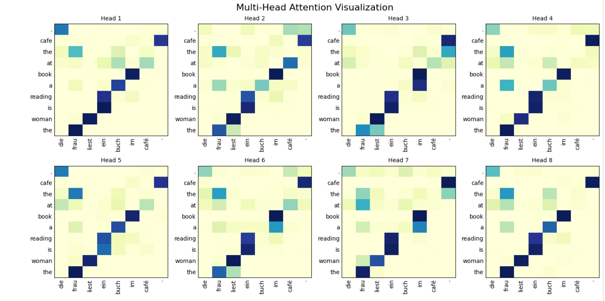
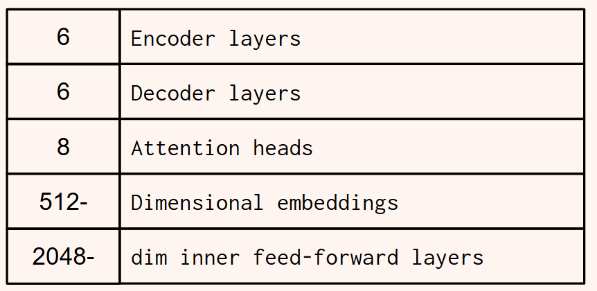
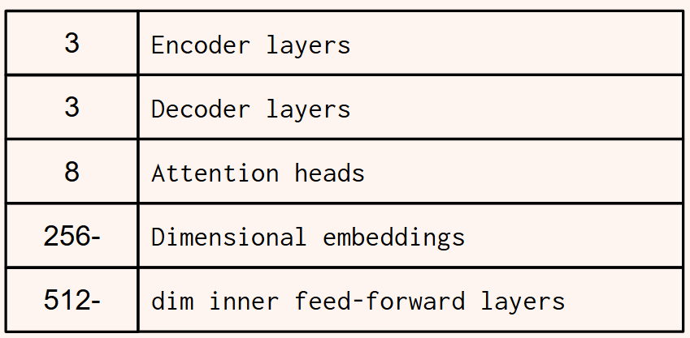
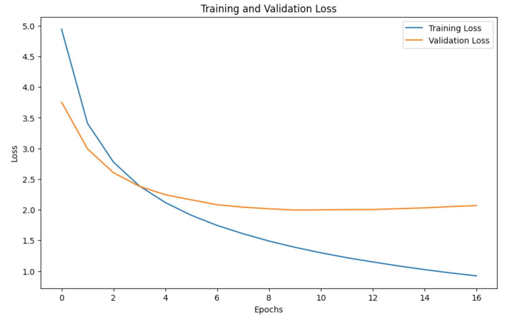

# You just want Attention!

Florencia Doval, Nina Py, Fabio Villatoro 26'

### A re-implementation of the Attention Is All You Need Paper in Pytorch with the Multi30k dataset

#### Run the website (**[Watch Demo Video](static/demo.mp4)**):
    > pip install -r requirements.txt
    > python app.py
    Note: you'll need to download the files from this drive folder: https://drive.google.com/drive/folders/1NlJ4XYmepTn1YKZCwr_-7Dg_suPsQ1Hl?usp=sharing
    Save them in a folder called 'model' in the root of the project repo.

#### Complete implementation:
    All training code is in Pytorch_Multi30k_AIAYN.ipynb
    
    To run speech-to-text translation:
    > python speech_translate.py
    Note: you'll need to download the files from this drive folder: https://drive.google.com/drive/folders/1NlJ4XYmepTn1YKZCwr_-7Dg_suPsQ1Hl?usp=sharing
    Save them in a folder called 'model' in the root of the project repo.

Google Colab: https://colab.research.google.com/drive/1jkWL-MpFuMrmhAlenytciUatqugA5Oah?usp=sharing

### Introduction

We implemented the famous paper _Attention is all you need_ which innovated by proposing the Transformer, as a network architecture that relied only on Attention mechanisms and performed better in Natural Language Processing tasks than any other model at the time in 2017. They accomplished a 28.4 BLEU on the WMT 2014 English-to-German translation task. For our implementation we used the Multi30K dataset with image captions in German and in English.

In addition to replicating the Transformer architecture, our project extends it with Whisper AI integration for speech-to-text translation. The complete pipeline accepts spoken German, transcribes it into text, translates it to English using our trained Transformer, and then synthesizes the output as speech using Google TTS for a complete cycle of language translation.

This is a structured prediction problem, specifically sequence-to-sequence learning for machine translation, because the Transformer model takes an input sequence (English text) and produces a corresponding output sequence (German text). But can as well fall under the Supervised Learning category because we need clearly labeled input and output data in order to train and test our model’s accuracy.

### Methodology

We implemented a scaled-down version of the Transformer model in PyTorch. Initially, we followed the architecture as described in the paper but adapted it to the size of the Multi30k dataset, which consists of 30,000 image captions in German and English.

We trained our model on Google Colab with an A100 GPU. Training took approximately 45 minutes per session.

### Results

At first, we implemented the exact same architecture as the paper _Attention is all you need_. Since we were getting extremely low learning rates and very high loss, we decided to decrease the size of our architecture to match the size of our model (significantly more reduced than the original dataset).

  
  

This allowed us to get a significantly higher learning rate, and smaller losses.

**Final Metrics:**

training loss = 1.8495

validation loss = 2.2612

Additionally, we were able to get a BLEU score of **33.30**, which is higher than what we were expecting for our stretch goal (~25), and higher than the result the authors of the _Attention is all you need_ paper got on the WMT dataset. This is not a surprise, since the WMT dataset is around 133 times larger than ours and contains more general content.

### Challenges

It has been definitely hard to translate, reimplement, and reimagine such a big chunk of logic to pytorch. Elements like Multi-headed attention have been particularly hard.

One of the most challenging parts of the implementation was to find a tokenization and hyperparameters that were appropriate for our data size to get good results. This was especially difficult because the model takes about 45 minutes to run with Google Colab’s A100 GPU (which slowed our ability to iterate and debug our code).

Our model was not learning at first, and then learning too slowly and giving really wrong translations. After fine tunning, we got significantly better results as described above. Nevertheless, the small dataset led to occasional <unk> tokens and missed translations.

Adapting our code and files to use Google Colab was also a bit challenging. We first had python files that we uploaded in the Runtime of Google Colab’s files folder every time we needed the model to run. This was not ideal for practicality, so we switched to notebook cells for the entirety of our code.

### Reflection

Throughout this project, we now understand better the importance of compute resources in DL. Using Google Colab's A100 GPU taught us to be strategic in our experimentation, and to planning each run given the training + evaluation takes almost an hour to run from beginning to end, which is costly both in time and money.

We also improved our ability to read and interpret academic papers. Implementing the Transformer gave us hands-on experience with translating concepts into code.

This experience also made us realize that we still have a long way to go to be able to dominate PyTorch, as well as implementing papers from scratch.

#### How do you feel your project ultimately turned out? How did you do relative to your base/target/stretch goals? Did your model work out the way you expected it to?
Our initial goals were:
    
    Base: Successfully implement and train a Transformer on 200,000 entries from the WMT 2014 dataset. Achieve a good BLEU score ( ≥10 ) on the test set.

    Target: Fine tune hyperparameters to achieve a better BLEU score ( ≥20 ), comparable to smaller-scale benchmarks of the original paper.

    Stretch: Improve BLEU score ( ≥25 ) through fine tuning, and evaluate on additional datasets. Use speech to text algorithms to create a complete translation software that can recognize speech and translate in real time. Time permitting, the translation will also be given in audio format to the user.

Overall, the model worked as expected. We successfully implemented a Transformer model in PyTorch, trained it on a subset of the Multi30k dataset, and achieved a BLEU score of 33.30, which exceeded the threashold we had initially planned for our base, target and stretch goals. While some translations were not perfect and occasionally outputted <unk> tokens or skipped words, the results confirmed that our scaled-down model was learning meaningful sequence-to-sequence patterns. We also added the Whisper AI API for audio-to-text input/output for seamless DE-ENG translation. The thing we didn't get to do from our initial stretch goal was to evaluate our model on a completely different dataset. Looking back at it now, this might not necessarily work. Since the Multi30K dataset is composed uniquely of descriptive sentences, it might be hard to generalize to other kinds of inputs successfully.

### How did your approach change over time? What kind of pivots did you make, if any?

The major pivot in our implementation was the dataset we used for training. At first, we were planning on using 200,000 entries from the WMT 2014 dataset but switched to the Multi30K to satisfy the final project requirements. We chose this dataset because we found that people were able to train their transformers on the same dataset with good results in the past, and the size of the dataset would also allow us to train our model in an acceptable runtime given our computational constraints. We also shifted from coding Python on VSCode to running our entire pipeline in Google Colab notebooks to make use of A100 GPUs to train our model. This required us to adapt our code to run in a notebook. One challenge of using Colab is that the session's runtime often got disconnect, which forced us to run it several times before getting the final model.

### What would you have done differently if you could do your project over again?

If we were to do the project all over again, we would definitely study more in depth specifics of our dataset at an earlier stage of the project. For instance, if we had realized that training on captions would make our model less generalizable maybe we should have chosen a more general one. With our current knowledge, we might have chosen a slightly bigger one for better results too.

If we were to start from scratch, we would have used a smaller architecture from the beginning to avoid wasting time adapting our architecture and running our code to get acceptable results. Maybe our results would have been even better at the end if we dedicated more time to fine tunning!

Storing the model earlier in the training would have also help us test its functionality without having to run everything from scratch every time (which can take up a lot of time).

### What do you think you can further improve on if you had more time?

If we had more time to refine this project, we would have definitely tried to extend the model to larger datasets like WMT14 for better generalization, and similarly to what we did with our model, would have spent a significant amount of time fine tunning to get the best results we can achieve.

Another area for improvement could be the tokenization and embedding strategies to handle rare words better and reduce <unk> tokens, hopefully leading to better results.

### What are your biggest takeaways from this project/what did you learn?

Our biggest takeaway was getting a hands-on understanding of how Transformers work by building one from scratch. We saw how important good preprocessing, tokenization, and fine-tuning are for getting acceptable results. Working with Colab also taught us to be smart about our code and experiments, since every run came with real time and cost trade-offs.
